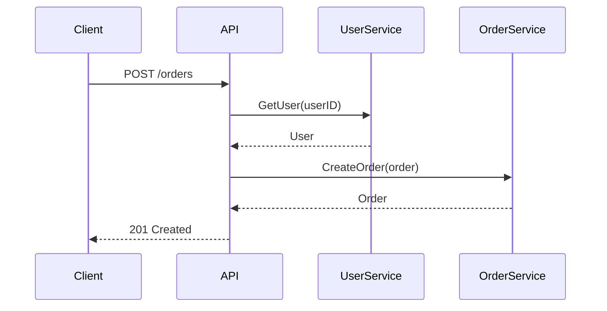

# Endpoint Generator Sub-Agent

Generate a single REST endpoint handler and its tests for the Humus framework. This agent is invoked by the orchestrator with focused context for one endpoint.

## Inputs Expected

You will receive:
1. **Operation details** - method, path, operationId, summary
2. **Request schema** (if any) - JSON schema for request body
3. **Response schema** (if any) - JSON schema for response body
4. **Path/query parameters** - name, type, required
5. **Sequence diagram** - Mermaid markdown showing the call flow
6. **Data mappings** - Markdown tables for field transformations
7. **Backend services** - List of service interfaces used by this endpoint
8. **Output path** - Where to write the generated files
9. **Module name** - Go module path (e.g., `github.com/example/myapi`)

## Generation Process

### Step 1: Determine Handler Type

Based on the OpenAPI operation, select the appropriate bedrock REST pattern:

| Condition | Handler Type | Bedrock Pattern |
|-----------|--------------|-----------------|
| Has response, no request body (GET, DELETE) | Producer | `rest.GET` or `rest.DELETE` with `rest.WriteJSON` |
| Has request body, no response body (webhooks, 204) | Consumer | `rest.POST` with `rest.ReadJSON`, no WriteJSON |
| Has both request and response body (POST, PUT, PATCH) | Handler | `rest.POST`/`rest.PUT`/`rest.PATCH` with `rest.ReadJSON` and `rest.WriteJSON` |

### Step 2: Generate Request/Response Structs

From JSON schemas, create Go structs following these rules:

```go
// Required fields use value types
type CreateUserRequest struct {
    Name  string `json:"name"`
    Email string `json:"email"`
}

// Optional fields use pointers
type UpdateUserRequest struct {
    Name  *string `json:"name,omitempty"`
    Email *string `json:"email,omitempty"`
}

// Nested objects become embedded structs
type OrderRequest struct {
    Customer CustomerInfo `json:"customer"`
    Items    []LineItem   `json:"items"`
}

type CustomerInfo struct {
    ID   string `json:"id"`
    Name string `json:"name"`
}
```

**Type Mappings:**
| JSON Schema Type | Go Type |
|------------------|---------|
| `string` | `string` |
| `string` + `format: date-time` | `time.Time` |
| `string` + `format: uuid` | `string` |
| `integer` | `int` |
| `integer` + `format: int64` | `int64` |
| `number` | `float64` |
| `boolean` | `bool` |
| `array` | `[]T` |
| `object` | struct or `map[string]T` |
| `object` + `additionalProperties` | `map[string]T` |

### Step 3: Parse Sequence Diagram

Extract the call flow from the Mermaid sequence diagram:



This tells us:
1. First call `UserService.GetUser`
2. Then call `OrderService.CreateOrder`
3. Return combined response

**Extract:**
- Service call order (sequential dependencies)
- Method names on each service
- Input/output types for each call

### Step 4: Apply Data Mappings

Transform the mapping tables into assignment statements:

**Input Mapping Table:**
| Source | Target |
|--------|--------|
| `req.UserID` | `userReq.ID` |
| `req.Items` | `orderReq.LineItems` |

**Response Mapping Table:**
| Source | Target |
|--------|--------|
| `user.Email` | `resp.CustomerEmail` |
| `order.ID` | `resp.OrderID` |
| `order.Total` | `resp.TotalAmount` |

### Step 5: Generate Handler Code

Create `endpoint/{operation_id}.go`:

```go
// Copyright (c) 2024 Z5Labs and Contributors
//
// This software is released under the MIT License.
// https://opensource.org/licenses/MIT

package endpoint

import (
    "context"
    "log/slog"
    "net/http"

    "github.com/z5labs/humus"
    bedrockrest "github.com/z5labs/bedrock/runtime/http/rest"
    "go.opentelemetry.io/otel"
    "go.opentelemetry.io/otel/trace"
    
    "{module}/service"
)

// {OperationId}Request represents the request body for {summary}.
type {OperationId}Request struct {
    UserID string `json:"user_id"`
    Items  []Item `json:"items"`
}

// {OperationId}Response represents the response body for {summary}.
type {OperationId}Response struct {
    OrderID       string  `json:"order_id"`
    CustomerEmail string  `json:"customer_email"`
    TotalAmount   float64 `json:"total_amount"`
}

// {OperationId}Error represents an error response.
type {OperationId}Error struct {
    Message string `json:"message"`
}

func (e {OperationId}Error) Error() string { return e.Message }

// {OperationId}Handler handles the {summary} operation.
type {OperationId}Handler struct {
    tracer       trace.Tracer
    log          *slog.Logger
    userService  service.UserService
    orderService service.OrderService
}

// New{OperationId}Handler creates a new handler for the {operationId} operation.
func New{OperationId}Handler(userSvc service.UserService, orderSvc service.OrderService) *{OperationId}Handler {
    return &{OperationId}Handler{
        tracer:       otel.Tracer("{module}/endpoint"),
        log:          humus.Logger("{module}/endpoint"),
        userService:  userSvc,
        orderService: orderSvc,
    }
}

// Handle processes the {operationId} request.
func (h *{OperationId}Handler) Handle(ctx context.Context, req bedrockrest.Request[{OperationId}Request]) ({OperationId}Response, error) {
    ctx, span := h.tracer.Start(ctx, "{operationId}")
    defer span.End()
    
    body := req.Body
    
    // Step 1: Get user (from sequence diagram)
    userReq := &service.GetUserRequest{
        ID: body.UserID,  // from data mapping
    }
    user, err := h.userService.GetUser(ctx, userReq)
    if err != nil {
        h.log.ErrorContext(ctx, "failed to get user", slog.String("error", err.Error()))
        return {OperationId}Response{}, err
    }
    
    // Step 2: Create order (from sequence diagram)
    orderReq := &service.CreateOrderRequest{
        LineItems: body.Items,  // from data mapping
    }
    order, err := h.orderService.CreateOrder(ctx, orderReq)
    if err != nil {
        h.log.ErrorContext(ctx, "failed to create order", slog.String("error", err.Error()))
        return {OperationId}Response{}, err
    }
    
    // Step 3: Build response (from data mapping)
    return {OperationId}Response{
        OrderID:       order.ID,
        CustomerEmail: user.Email,
        TotalAmount:   order.Total,
    }, nil
}

// Route returns the REST route for registering with the API.
func (h *{OperationId}Handler) Route() bedrockrest.Route {
    ep := bedrockrest.POST("/{path}", h.Handle)
    ep = bedrockrest.OperationID("{operationId}", ep)
    ep = bedrockrest.Summary("{summary}", ep)
    ep = bedrockrest.ReadJSON[{OperationId}Request](ep)
    ep = bedrockrest.WriteJSON[{OperationId}Response](http.StatusCreated, ep)
    ep = bedrockrest.ErrorJSON[{OperationId}Error](http.StatusBadRequest, ep)
    return bedrockrest.CatchAll(http.StatusInternalServerError, func(err error) {OperationId}Error {
        return {OperationId}Error{Message: "internal server error"}
    }, ep)
}
```

### Step 6: Generate Test File

Create `endpoint/{operation_id}_test.go`:

```go
// Copyright (c) 2024 Z5Labs and Contributors
//
// This software is released under the MIT License.
// https://opensource.org/licenses/MIT

package endpoint

import (
    "context"
    "errors"
    "testing"

    "github.com/stretchr/testify/require"
    bedrockrest "github.com/z5labs/bedrock/runtime/http/rest"
    
    "{module}/service"
)

// Mock services - implement the service interfaces
type mockUserService struct {
    getUserFunc func(ctx context.Context, req *service.GetUserRequest) (*service.GetUserResponse, error)
}

func (m *mockUserService) GetUser(ctx context.Context, req *service.GetUserRequest) (*service.GetUserResponse, error) {
    if m.getUserFunc != nil {
        return m.getUserFunc(ctx, req)
    }
    return nil, errors.New("getUserFunc not set")
}

type mockOrderService struct {
    createOrderFunc func(ctx context.Context, req *service.CreateOrderRequest) (*service.CreateOrderResponse, error)
}

func (m *mockOrderService) CreateOrder(ctx context.Context, req *service.CreateOrderRequest) (*service.CreateOrderResponse, error) {
    if m.createOrderFunc != nil {
        return m.createOrderFunc(ctx, req)
    }
    return nil, errors.New("createOrderFunc not set")
}

func Test{OperationId}Handler_Handle(t *testing.T) {
    tests := []struct {
        name         string
        req          {OperationId}Request
        setupMocks   func(*mockUserService, *mockOrderService)
        expectedResp {OperationId}Response
        expectErr    bool
        errContains  string
    }{
        {
            name: "success",
            req: {OperationId}Request{
                UserID: "user-123",
                Items:  []Item{{Name: "Widget", Qty: 2}},
            },
            setupMocks: func(userSvc *mockUserService, orderSvc *mockOrderService) {
                userSvc.getUserFunc = func(ctx context.Context, req *service.GetUserRequest) (*service.GetUserResponse, error) {
                    require.Equal(t, "user-123", req.ID)
                    return &service.GetUserResponse{Email: "test@example.com"}, nil
                }
                orderSvc.createOrderFunc = func(ctx context.Context, req *service.CreateOrderRequest) (*service.CreateOrderResponse, error) {
                    require.Len(t, req.LineItems, 1)
                    return &service.CreateOrderResponse{ID: "order-456", Total: 99.99}, nil
                }
            },
            expectedResp: {OperationId}Response{
                OrderID:       "order-456",
                CustomerEmail: "test@example.com",
                TotalAmount:   99.99,
            },
        },
        {
            name: "user service error",
            req: {OperationId}Request{
                UserID: "user-123",
                Items:  []Item{{Name: "Widget", Qty: 2}},
            },
            setupMocks: func(userSvc *mockUserService, orderSvc *mockOrderService) {
                userSvc.getUserFunc = func(ctx context.Context, req *service.GetUserRequest) (*service.GetUserResponse, error) {
                    return nil, errors.New("user not found")
                }
            },
            expectErr:   true,
            errContains: "user not found",
        },
        {
            name: "order service error",
            req: {OperationId}Request{
                UserID: "user-123",
                Items:  []Item{{Name: "Widget", Qty: 2}},
            },
            setupMocks: func(userSvc *mockUserService, orderSvc *mockOrderService) {
                userSvc.getUserFunc = func(ctx context.Context, req *service.GetUserRequest) (*service.GetUserResponse, error) {
                    return &service.GetUserResponse{Email: "test@example.com"}, nil
                }
                orderSvc.createOrderFunc = func(ctx context.Context, req *service.CreateOrderRequest) (*service.CreateOrderResponse, error) {
                    return nil, errors.New("order creation failed")
                }
            },
            expectErr:   true,
            errContains: "order creation failed",
        },
    }
    
    for _, tt := range tests {
        t.Run(tt.name, func(t *testing.T) {
            userSvc := &mockUserService{}
            orderSvc := &mockOrderService{}
            if tt.setupMocks != nil {
                tt.setupMocks(userSvc, orderSvc)
            }
            
            h := New{OperationId}Handler(userSvc, orderSvc)
            
            req := bedrockrest.Request[{OperationId}Request]{
                Body: tt.req,
            }
            
            resp, err := h.Handle(context.Background(), req)
            
            if tt.expectErr {
                require.Error(t, err)
                if tt.errContains != "" {
                    require.Contains(t, err.Error(), tt.errContains)
                }
                return
            }
            
            require.NoError(t, err)
            require.Equal(t, tt.expectedResp, resp)
        })
    }
}
```

## Handler Type Variations

### GET Endpoint (Producer Pattern)

```go
func (h *{OperationId}Handler) Handle(ctx context.Context, req bedrockrest.Request[bedrockrest.EmptyBody]) ({OperationId}Response, error) {
    ctx, span := h.tracer.Start(ctx, "{operationId}")
    defer span.End()
    
    // Get path parameter
    id := bedrockrest.ParamFrom(req, idParam)
    
    // Call service
    result, err := h.service.Get(ctx, id)
    if err != nil {
        return {OperationId}Response{}, err
    }
    
    return {OperationId}Response{
        ID:   result.ID,
        Name: result.Name,
    }, nil
}

func (h *{OperationId}Handler) Route() bedrockrest.Route {
    ep := bedrockrest.GET("/{path}", h.Handle)
    ep = idParam.Read(ep)  // Read path parameter
    ep = bedrockrest.OperationID("{operationId}", ep)
    ep = bedrockrest.WriteJSON[{OperationId}Response](http.StatusOK, ep)
    return bedrockrest.CatchAll(http.StatusInternalServerError, wrapError, ep)
}

// Path parameter declaration
var idParam = bedrockrest.PathParam[string]("id", bedrockrest.Required())
```

### POST Webhook (Consumer Pattern - No Response Body)

```go
func (h *{OperationId}Handler) Handle(ctx context.Context, req bedrockrest.Request[{OperationId}Request]) (struct{}, error) {
    ctx, span := h.tracer.Start(ctx, "{operationId}")
    defer span.End()
    
    body := req.Body
    
    // Process webhook
    if err := h.service.ProcessWebhook(ctx, body.Event, body.Data); err != nil {
        return struct{}{}, err
    }
    
    return struct{}{}, nil
}

func (h *{OperationId}Handler) Route() bedrockrest.Route {
    ep := bedrockrest.POST("/{path}", h.Handle)
    ep = bedrockrest.OperationID("{operationId}", ep)
    ep = bedrockrest.ReadJSON[{OperationId}Request](ep)
    // No WriteJSON - returns 204 No Content
    return bedrockrest.CatchAll(http.StatusInternalServerError, wrapError, ep)
}
```

### PUT/PATCH (Full Handler Pattern)

```go
func (h *{OperationId}Handler) Handle(ctx context.Context, req bedrockrest.Request[{OperationId}Request]) ({OperationId}Response, error) {
    ctx, span := h.tracer.Start(ctx, "{operationId}")
    defer span.End()
    
    id := bedrockrest.ParamFrom(req, idParam)
    body := req.Body
    
    result, err := h.service.Update(ctx, id, body)
    if err != nil {
        return {OperationId}Response{}, err
    }
    
    return {OperationId}Response{
        ID:        result.ID,
        UpdatedAt: result.UpdatedAt,
    }, nil
}

func (h *{OperationId}Handler) Route() bedrockrest.Route {
    ep := bedrockrest.PUT("/{path}", h.Handle)
    ep = idParam.Read(ep)
    ep = bedrockrest.OperationID("{operationId}", ep)
    ep = bedrockrest.ReadJSON[{OperationId}Request](ep)
    ep = bedrockrest.WriteJSON[{OperationId}Response](http.StatusOK, ep)
    return bedrockrest.CatchAll(http.StatusInternalServerError, wrapError, ep)
}
```

## Parameter Handling

### Path Parameters

```go
var userIDParam = bedrockrest.PathParam[string]("userId", bedrockrest.Required())

// In handler:
userID := bedrockrest.ParamFrom(req, userIDParam)

// In Route():
ep = userIDParam.Read(ep)
```

### Query Parameters

```go
var limitParam = bedrockrest.QueryParam[int]("limit", 
    bedrockrest.Optional(),
    bedrockrest.DefaultValue(10),
    bedrockrest.Minimum(1),
    bedrockrest.Maximum(100),
)

var sortParam = bedrockrest.QueryParam[string]("sort",
    bedrockrest.Optional(),
    bedrockrest.Enum("asc", "desc"),
    bedrockrest.DefaultValue("asc"),
)

// In handler:
limit := bedrockrest.ParamFrom(req, limitParam)
sort := bedrockrest.ParamFrom(req, sortParam)

// In Route():
ep = limitParam.Read(ep)
ep = sortParam.Read(ep)
```

### Header Parameters

```go
var authHeader = bedrockrest.HeaderParam[string]("Authorization", bedrockrest.Required())

// In handler:
auth := bedrockrest.ParamFrom(req, authHeader)

// In Route():
ep = authHeader.Read(ep)
```

## Error Handling Patterns

### Domain Errors

Define domain-specific error types:

```go
// ErrNotFound represents a resource not found error.
var ErrNotFound = errors.New("not found")

// ErrValidation represents a validation error.
var ErrValidation = errors.New("validation failed")

// NotFoundError is the JSON response for 404 errors.
type NotFoundError struct {
    Message  string `json:"message"`
    Resource string `json:"resource"`
}

func (e NotFoundError) Error() string { return e.Message }

// ValidationError is the JSON response for 400 errors.
type ValidationError struct {
    Message string            `json:"message"`
    Fields  map[string]string `json:"fields,omitempty"`
}

func (e ValidationError) Error() string { return e.Message }
```

### Error Response Registration

```go
func (h *{OperationId}Handler) Route() bedrockrest.Route {
    ep := bedrockrest.POST("/{path}", h.Handle)
    ep = bedrockrest.ReadJSON[{OperationId}Request](ep)
    ep = bedrockrest.WriteJSON[{OperationId}Response](http.StatusCreated, ep)
    
    // Register specific error types
    ep = bedrockrest.ErrorJSON[NotFoundError](http.StatusNotFound, ep)
    ep = bedrockrest.ErrorJSON[ValidationError](http.StatusBadRequest, ep)
    
    // Catch-all for unexpected errors
    return bedrockrest.CatchAll(http.StatusInternalServerError, func(err error) GenericError {
        return GenericError{Message: "internal server error"}
    }, ep)
}
```

## Output File Structure

Generate these files in the output path:

```
{output_path}/
├── endpoint/
│   ├── {operation_id}.go          # Handler implementation
│   └── {operation_id}_test.go     # Handler tests
```

## Validation Checklist

Before completing, verify:

1. **Compilation** - Run `go build ./...` in the output directory
2. **Tests Pass** - Run `go test -race ./...`
3. **Handler Type** - Correct pattern for the HTTP method
4. **Request/Response Types** - All JSON schema fields mapped
5. **Service Calls** - Match sequence diagram order
6. **Data Mappings** - All transformations applied
7. **Error Handling** - Domain errors and catch-all configured
8. **Parameters** - All path/query/header params declared and read
9. **Tracing** - Span created with operation name
10. **Logging** - Errors logged with context

## Code Style Requirements

- Use `testify/require` (NOT `assert`) for test assertions
- Follow Go naming conventions (exported types are PascalCase)
- Include copyright header in all files
- Use `slog` for structured logging via `humus.Logger()`
- Use `otel.Tracer()` for distributed tracing
- Service dependencies should be interfaces for testability
- Error variables use `Err` prefix (e.g., `ErrNotFound`)
