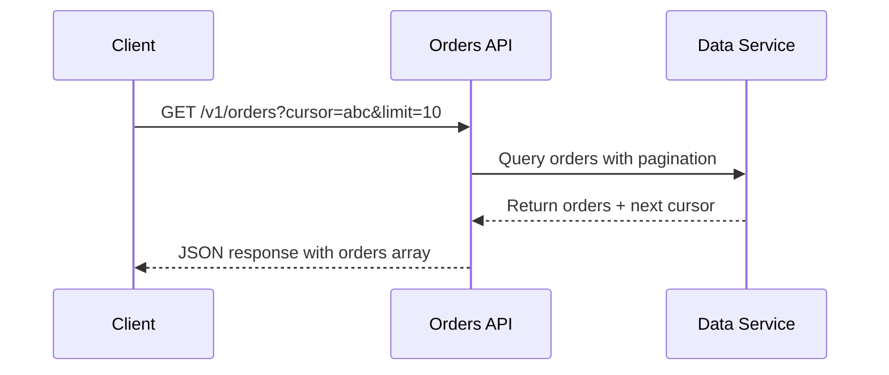
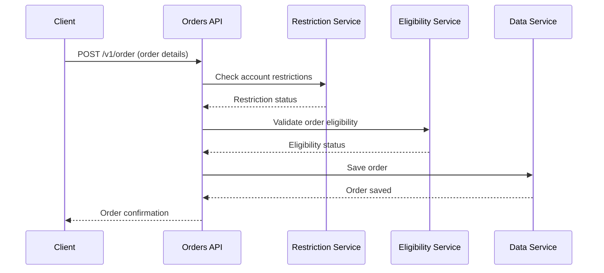

In this walkthrough, you'll build a complete order management REST API that demonstrates key Humus patterns including service orchestration, cursor-based pagination, and automatic OpenTelemetry instrumentation.

## What You'll Build

A REST API with two endpoints:
- **GET /v1/orders** - List orders with cursor-based pagination and filtering
- **POST /v1/order** - Place orders with multi-service orchestration

The API integrates with three backend services:
- **Data Service** - DynamoDB-like storage for orders
- **Restriction Service** - Checks account restrictions (fraud, trading holds)
- **Eligibility Service** - Validates order eligibility

## Architecture Overview

The API orchestrates calls to three backend services with different flows for each endpoint:

### GET /v1/orders - List Orders Flow

### POST /v1/order - Place Order Flow

## Learning Objectives

By the end of this walkthrough, you will:

1. **Structure a Humus REST application** - Understand the endpoint/service/app pattern where endpoints define interfaces
2. **Implement service interfaces** - Create HTTP client wrappers with proper error handling
3. **Use RPC patterns** - Apply `rpc.ProduceJson` for GET and `rpc.HandleJson` for POST
4. **Add query parameters** - Use `rest.QueryParam` with validation
5. **Implement cursor-based pagination** - Build scalable pagination with base64 cursors
6. **Orchestrate services** - Chain multiple service calls with error handling
7. **View distributed traces** - See how OpenTelemetry automatically instruments your API

## Prerequisites

- **Go 1.24 or later** - Check with `go version`
- **Podman** (or Docker) - For running infrastructure services
- **curl** or similar HTTP client - For testing endpoints
- **Basic Go knowledge** - Structs, interfaces, HTTP handlers

## Time Estimate

**45-60 minutes** to complete all sections

## Source Code

The complete source code is available at:
[`example/rest/orders-walkthrough/`](https://github.com/z5labs/humus/tree/main/example/rest/orders-walkthrough)

## Walkthrough Sections

1. **[Project Setup]()** - Create directory structure and initialize the module
2. **[Minimal Running App]()** - Create a minimal REST API to verify setup
3. **[Scaffolding Endpoints]()** - Define domain types and scaffold endpoints with dummy responses
4. **[Backend Services]()** - Implement data storage, restriction, and eligibility service clients
5. **[List Orders Endpoint]()** - Implement GET /v1/orders with pagination
6. **[Place Order Endpoint]()** - Implement POST /v1/order with orchestration
7. **[Infrastructure & Observability]()** - Set up Podman Compose with observability stack
8. **[Exploring Traces & Metrics]()** - Explore traces, logs, and metrics in Grafana
9. **[Running & Testing]()** - End-to-end testing scenarios

Let's get started!

[Begin with Project Setup →]()
