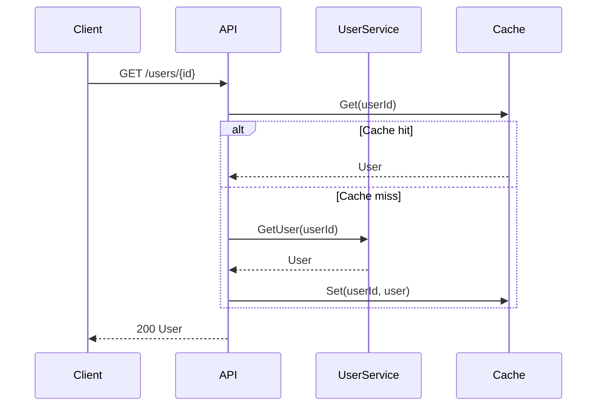

# REST API Generator Agent System

Generate complete, production-ready Humus REST API applications from specifications.

## Overview

This agent system transforms your API design documents into working Go code:

```
OpenAPI Spec + Backend Specs + Sequence Diagrams + Data Mappings
                              ↓
                    implement-rest-api (orchestrator)
                              ↓
         ┌────────────────────┼────────────────────┐
         ↓                    ↓                    ↓
   implement-endpoint   implement-endpoint   implement-service
         ↓                    ↓                    ↓
    endpoint/get_user.go  endpoint/create_order.go  service/inventory.go
```

## Quick Start

### 1. Prepare Your Specifications

Create a `specs/` directory with your design documents:

```
my-project/
└── specs/
    ├── api.yaml              # OpenAPI 3.x spec (required)
    ├── backends/
    │   ├── user-service.yaml # Backend REST API spec
    │   ├── orders.proto      # Backend gRPC service
    │   └── products.sql      # Database schema
    ├── sequences/
    │   ├── get-user.md       # Mermaid sequence diagram
    │   └── create-order.md
    └── mappings/
        ├── get-user.md       # Data mapping tables
        └── create-order.md
```

### 2. Invoke the Generator

```
/implement-rest-api
OpenAPI spec: specs/api.yaml
Backend specs: specs/backends/
Sequence diagrams: specs/sequences/
Data mappings: specs/mappings/
Output directory: ./
Module name: github.com/myorg/my-service
```

### 3. Review Generated Code

The agent generates:

```
my-service/
├── main.go              # Entry point with embedded config
├── config.yaml          # Humus configuration
├── app/
│   └── app.go          # Init function with all endpoint registrations
├── endpoint/
│   ├── get_user.go     # Handler implementation
│   ├── get_user_test.go
│   ├── create_order.go
│   └── create_order_test.go
├── service/
│   ├── user.go         # REST backend client
│   ├── user_test.go
│   └── inventory.go    # Another backend client
├── go.mod
└── go.sum
```

## Input Specification Formats

### OpenAPI 3.x Spec (Required)

Standard OpenAPI 3.0 or 3.1 YAML/JSON. The generator extracts:

- Operations (method, path, operationId)
- Request/response schemas → Go structs
- Parameters → Handler arguments
- Security requirements → Authentication setup

```yaml
openapi: 3.0.3
info:
  title: My API
  version: 1.0.0
paths:
  /users/{id}:
    get:
      operationId: getUser
      parameters:
        - name: id
          in: path
          required: true
          schema:
            type: string
      responses:
        '200':
          content:
            application/json:
              schema:
                $ref: '#/components/schemas/User'
```

### Backend Specifications

Place backend specs in `specs/backends/`. Supported types:

| Type | Extension | Description |
|------|-----------|-------------|
| REST API | `.yaml`, `.json` | OpenAPI spec of backend service |
| gRPC | `.proto` | Protocol buffer service definition |
| Database | `.sql` | SQL DDL with CREATE TABLE statements |

**gRPC Note**: For gRPC backends, the generator outputs `protoc` commands rather than wrapper code. Use the generated gRPC client directly in your handlers.

### Sequence Diagrams

Use Mermaid markdown in `specs/sequences/{operationId}.md`:

```markdown
# Get User Sequence


```

The generator translates this into:
1. Sequential service calls in order shown
2. Conditional logic for `alt` blocks
3. Loop handling for `loop` blocks
4. Parallel calls for `par` blocks (future)

### Data Mappings

Use markdown tables in `specs/mappings/{operationId}.md`:

```markdown
# Get User Data Mapping

## Input Mapping (API Request → Backend Request)

| Source | Target | Transform |
|--------|--------|-----------|
| pathParams.id | userReq.ID | - |
| queryParams.include | userReq.Fields | split(",") |

## Response Mapping (Backend Response → API Response)

| Source | Target | Transform |
|--------|--------|-----------|
| user.ID | resp.id | - |
| user.FullName | resp.name | - |
| user.Email | resp.contact.email | - |
| user.CreatedAt | resp.created_at | RFC3339 |
```

Supported transforms:
- `-` or empty: Direct assignment
- `split(",")`: Split string to slice
- `join(",")`: Join slice to string
- `RFC3339`: Format time as RFC3339 string
- `int`, `string`, `float64`: Type conversion

## Handler Type Selection

The generator automatically selects the appropriate Humus handler pattern:

| OpenAPI Definition | Handler Type | Generated Pattern |
|-------------------|--------------|-------------------|
| No requestBody, has response | Producer | `bedrockrest.GET` + `WriteJSON[Resp](status, ep)` |
| Has requestBody, no response (204) | Consumer | `bedrockrest.POST` + `ReadJSON[Req](ep)` + `WriteBinary(204, "", ep)` |
| Has requestBody and response | Handler | `bedrockrest.POST` + `ReadJSON[Req](ep)` + `WriteJSON[Resp](status, ep)` |
| No requestBody, no response (204) | Delete | `bedrockrest.DELETE` + `WriteBinary(204, "", ep)` |

All types require `ErrorJSON` + `CatchAll` composition to produce a complete `Route`.

## Incremental Generation

The agent supports adding endpoints to existing projects:

1. It detects existing `app/app.go` and reads current registrations
2. New endpoints are added without disturbing existing code
3. Existing services are reused; only new ones are generated
4. Progress is tracked in SQL for resumability

To add a new endpoint:
1. Add the operation to your OpenAPI spec
2. Create sequence diagram and mapping files
3. Re-run the generator with the same output directory

## Troubleshooting

### Build Errors

If generated code doesn't compile:

1. Check `go mod tidy` output for missing dependencies
2. Review generated structs match your OpenAPI schemas
3. Verify service client imports are correct

### Test Failures

If generated tests fail:

1. Tests use mocked services—check mock implementations
2. Verify data mappings produce expected output
3. Check for nil pointer issues in optional fields

### Missing Mappings

If endpoints are generated without mappings:

1. Ensure mapping file names match operationIds
2. Check markdown table format (requires header row with `|`)
3. Verify source paths match your schema field names

## Reference Documentation

- [Spec Formats](./spec-formats.md) - Detailed parsing rules for all input formats
- [Code Templates](./code-templates.md) - Exact templates used for code generation
- [Humus REST Patterns](../humus-rest.instructions.md) - Framework conventions

## Example Projects

After generation, your project follows this pattern:

```go
// main.go
package main

import (
    "context"
    "github.com/z5labs/humus/rest"
    "my-service/app"
)

func main() {
    rest.Run(context.Background(), app.Options()...)
}

// app/app.go
package app

import (
    "net/http"
    "github.com/z5labs/humus/rest"
    "my-service/endpoint/getuser"
    "my-service/service/userservice"
)

func Options() []rest.Option {
    userSvc := userservice.New(http.DefaultClient, "http://user-service:8080")
    
    return []rest.Option{
        rest.Title("My Service"),
        rest.Version("1.0.0"),
        getuser.Route(userSvc),
    }
}

// endpoint/getuser/getuser.go
package getuser

// ... complete handler implementation
```

## Limitations

- **Parallel backend calls**: Currently generates sequential calls only
- **GraphQL backends**: Not yet supported
- **File uploads**: Manual implementation required
- **WebSocket endpoints**: Not supported
- **Streaming responses**: Not supported

## Version

Compatible with:
- Humus framework (latest)
- Go 1.24+
- OpenAPI 3.0.x and 3.1.x
