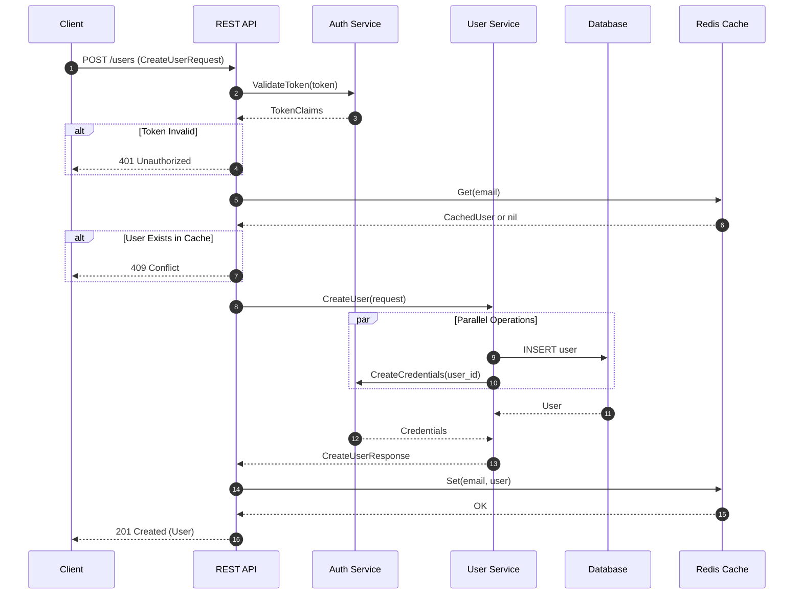

# REST API Generator - Specification Parsing Guide

This document provides comprehensive guidance for parsing various input specification formats used by the REST API generator agent system. Each section covers extraction rules, examples, and edge cases.

## Table of Contents

1. [OpenAPI 3.x Parsing](#1-openapi-3x-parsing)
2. [gRPC .proto Parsing](#2-grpc-proto-parsing)
3. [SQL DDL Parsing](#3-sql-ddl-parsing)
4. [Mermaid Sequence Diagram Parsing](#4-mermaid-sequence-diagram-parsing)
5. [Data Mapping Tables](#5-data-mapping-tables)

---

## 1. OpenAPI 3.x Parsing

### Overview

OpenAPI 3.x specifications define REST API contracts. Extract operations, schemas, and security requirements to generate Humus handlers.

### Data to Extract

#### Operation List

For each operation in `paths`, extract:

| Field | Location | Required |
|-------|----------|----------|
| HTTP Method | Key under path (get, post, put, delete, patch) | Yes |
| Path | Key in paths object | Yes |
| operationId | `operationId` field | Yes (generate if missing) |
| Summary | `summary` field | No |
| Description | `description` field | No |
| Tags | `tags` array | No |

#### Request Body Schema

Extract from `requestBody.content['application/json'].schema`:

| Field | Description |
|-------|-------------|
| Type | `type` field (object, array, string, etc.) |
| Required Fields | `required` array |
| Properties | `properties` object with field definitions |
| Nested Objects | Recursive schema definitions |
| References | `$ref` pointers to `#/components/schemas/*` |

#### Response Schemas

Extract from `responses`:

| Field | Description |
|-------|-------------|
| Status Code | Key in responses object (200, 201, 400, etc.) |
| Body Schema | `content['application/json'].schema` |
| Description | `description` field |

#### Parameters

Extract from `parameters` array:

| Field | Values |
|-------|--------|
| Name | `name` field |
| Location | `in` field: path, query, header, cookie |
| Required | `required` boolean |
| Schema | `schema` object with type info |

#### Security Requirements

Extract from `security` array:

| Field | Description |
|-------|-------------|
| Scheme Name | Key in security object |
| Scopes | Array value (for OAuth2) |

### Handler Type Determination

Use this decision matrix to determine which Humus handler type to generate:

| Has RequestBody? | Has Response Body? | Handler Type | Humus Wrapper |
|------------------|-------------------|--------------|---------------|
| No | Yes | Producer | `rest.ProduceJson(handler)` |
| Yes | No | Consumer | `rest.ConsumeOnlyJson(handler)` |
| Yes | Yes | Handler | `rest.HandleJson(handler)` |
| No | No | Raw Handler | Custom `http.Handler` |

**Notes:**
- "No Response Body" means either no `responses` defined, only error responses (4xx/5xx), or 204 No Content
- "Has Response Body" means 200/201 response with `content` defined

### Example: OpenAPI Operation

**Input (OpenAPI YAML):**

```yaml
paths:
  /users/{userId}:
    get:
      operationId: getUser
      summary: Get a user by ID
      tags:
        - Users
      parameters:
        - name: userId
          in: path
          required: true
          schema:
            type: string
            format: uuid
        - name: include
          in: query
          required: false
          schema:
            type: string
            enum: [profile, settings, both]
      responses:
        '200':
          description: Successful response
          content:
            application/json:
              schema:
                $ref: '#/components/schemas/User'
        '404':
          description: User not found
      security:
        - bearerAuth: []

    put:
      operationId: updateUser
      summary: Update a user
      parameters:
        - name: userId
          in: path
          required: true
          schema:
            type: string
      requestBody:
        required: true
        content:
          application/json:
            schema:
              $ref: '#/components/schemas/UpdateUserRequest'
      responses:
        '200':
          description: Updated user
          content:
            application/json:
              schema:
                $ref: '#/components/schemas/User'

  /webhooks/payment:
    post:
      operationId: handlePaymentWebhook
      summary: Handle payment webhook
      requestBody:
        required: true
        content:
          application/json:
            schema:
              $ref: '#/components/schemas/PaymentEvent'
      responses:
        '204':
          description: Webhook processed

components:
  schemas:
    User:
      type: object
      required:
        - id
        - email
      properties:
        id:
          type: string
          format: uuid
        email:
          type: string
          format: email
        profile:
          $ref: '#/components/schemas/Profile'

    Profile:
      type: object
      properties:
        firstName:
          type: string
        lastName:
          type: string
        age:
          type: integer
          minimum: 0

    UpdateUserRequest:
      type: object
      properties:
        email:
          type: string
        profile:
          $ref: '#/components/schemas/Profile'

    PaymentEvent:
      type: object
      required:
        - eventId
        - eventType
      properties:
        eventId:
          type: string
        eventType:
          type: string
          enum: [payment.completed, payment.failed]
        amount:
          type: number

  securitySchemes:
    bearerAuth:
      type: http
      scheme: bearer
      bearerFormat: JWT
```

**Extracted Data:**

```
Operation 1: getUser
├── Method: GET
├── Path: /users/{userId}
├── Handler Type: Producer (no requestBody, has response)
├── Parameters:
│   ├── userId (path, required, string/uuid)
│   └── include (query, optional, string enum)
├── Response: 200 → User schema
└── Security: bearerAuth (JWT)

Operation 2: updateUser
├── Method: PUT
├── Path: /users/{userId}
├── Handler Type: Handler (has requestBody AND response)
├── Parameters:
│   └── userId (path, required, string)
├── Request: UpdateUserRequest schema
└── Response: 200 → User schema

Operation 3: handlePaymentWebhook
├── Method: POST
├── Path: /webhooks/payment
├── Handler Type: Consumer (has requestBody, 204 No Content)
├── Request: PaymentEvent schema
└── Response: 204 (no body)
```

**Generated Go Types:**

```go
// From User schema
type User struct {
    ID      string   `json:"id"`
    Email   string   `json:"email"`
    Profile *Profile `json:"profile,omitempty"`
}

// From Profile schema (nested)
type Profile struct {
    FirstName string `json:"firstName,omitempty"`
    LastName  string `json:"lastName,omitempty"`
    Age       int    `json:"age,omitempty"`
}

// From UpdateUserRequest schema
type UpdateUserRequest struct {
    Email   string   `json:"email,omitempty"`
    Profile *Profile `json:"profile,omitempty"`
}

// From PaymentEvent schema
type PaymentEvent struct {
    EventID   string  `json:"eventId"`
    EventType string  `json:"eventType"`
    Amount    float64 `json:"amount,omitempty"`
}
```

### Edge Cases

#### Missing operationId

Generate from method + path:
- `GET /users/{id}` → `getUsers_id` or `GetUserById`

#### Inline Schemas vs References

Handle both:
```yaml
# Reference - resolve from components
schema:
  $ref: '#/components/schemas/User'

# Inline - generate type name from context
schema:
  type: object
  properties:
    name:
      type: string
```

For inline schemas, generate type name as: `{OperationId}{Request|Response}`

#### Multiple Content Types

Prefer `application/json`. Fall back order:
1. `application/json`
2. `application/*+json`
3. `text/plain` (string body)
4. First available content type

#### Circular References

Track visited schemas to prevent infinite loops:
```yaml
# Circular: User → Profile → User
User:
  properties:
    profile:
      $ref: '#/components/schemas/Profile'
Profile:
  properties:
    owner:
      $ref: '#/components/schemas/User'
```

Use pointers for potentially circular references: `Owner *User`

#### AllOf/OneOf/AnyOf

| Keyword | Go Mapping |
|---------|------------|
| allOf | Embed all types in struct |
| oneOf | Interface with type switch |
| anyOf | Interface (same as oneOf) |

---

## 2. gRPC .proto Parsing

### Overview

Parse Protocol Buffer definitions to understand service contracts for hybrid REST/gRPC services or when generating REST facades for gRPC backends.

### Data to Extract

#### Service Definitions

| Field | Description |
|-------|-------------|
| Service Name | `service ServiceName` declaration |
| Methods | `rpc MethodName(Request) returns (Response)` |
| Options | Service-level options (e.g., HTTP bindings) |

#### Method Signatures

| Field | Description |
|-------|-------------|
| Method Name | RPC method identifier |
| Request Type | Input message type |
| Response Type | Output message type |
| Streaming | `stream` keyword on request/response |

#### Message Definitions

| Field | Description |
|-------|-------------|
| Message Name | `message MessageName` declaration |
| Fields | Field definitions with type and number |
| Nested Messages | Messages defined inside other messages |
| Enums | Enum definitions |
| OneOf | Union fields |

#### Package Information

| Field | Description |
|-------|-------------|
| Package | `package name;` declaration |
| Go Package | `option go_package = "...";` |
| Imports | `import "path/to/file.proto";` |

### Streaming Type Mapping

| Request | Response | Type | REST Equivalent |
|---------|----------|------|-----------------|
| No stream | No stream | Unary | Standard request/response |
| stream | No stream | Client streaming | Chunked upload |
| No stream | stream | Server streaming | SSE / chunked response |
| stream | stream | Bidirectional | WebSocket |

### Example: Proto Service Definition

**Input (.proto file):**

```protobuf
syntax = "proto3";

package petstore.v1;

option go_package = "github.com/example/petstore/petstorepb";

import "google/protobuf/timestamp.proto";

// PetService provides operations for managing pets
service PetService {
  // CreatePet creates a new pet
  rpc CreatePet(CreatePetRequest) returns (Pet);
  
  // GetPet retrieves a pet by ID
  rpc GetPet(GetPetRequest) returns (Pet);
  
  // ListPets returns a stream of pets
  rpc ListPets(ListPetsRequest) returns (stream Pet);
  
  // UpdatePetStatus updates pet status with streaming updates
  rpc UpdatePetStatus(stream StatusUpdate) returns (StatusSummary);
}

// Pet represents a pet in the store
message Pet {
  string id = 1;
  string name = 2;
  Species species = 3;
  Status status = 4;
  google.protobuf.Timestamp created_at = 5;
  
  // Nested message for pet details
  message Details {
    int32 age = 1;
    string color = 2;
    repeated string vaccinations = 3;
  }
  
  Details details = 6;
}

enum Species {
  SPECIES_UNSPECIFIED = 0;
  SPECIES_DOG = 1;
  SPECIES_CAT = 2;
  SPECIES_BIRD = 3;
}

enum Status {
  STATUS_UNSPECIFIED = 0;
  STATUS_AVAILABLE = 1;
  STATUS_PENDING = 2;
  STATUS_SOLD = 3;
}

message CreatePetRequest {
  string name = 1;
  Species species = 2;
  Pet.Details details = 3;
}

message GetPetRequest {
  string id = 1;
}

message ListPetsRequest {
  int32 page_size = 1;
  string page_token = 2;
  
  // Filter options
  oneof filter {
    Species species = 3;
    Status status = 4;
  }
}

message StatusUpdate {
  string pet_id = 1;
  Status new_status = 2;
}

message StatusSummary {
  int32 updated_count = 1;
  repeated string failed_ids = 2;
}
```

**Extracted Data:**

```
Package: petstore.v1
Go Package: github.com/example/petstore/petstorepb

Service: PetService
├── Method: CreatePet
│   ├── Type: Unary
│   ├── Request: CreatePetRequest
│   └── Response: Pet
├── Method: GetPet
│   ├── Type: Unary
│   ├── Request: GetPetRequest
│   └── Response: Pet
├── Method: ListPets
│   ├── Type: Server Streaming
│   ├── Request: ListPetsRequest
│   └── Response: stream Pet
└── Method: UpdatePetStatus
    ├── Type: Client Streaming
    ├── Request: stream StatusUpdate
    └── Response: StatusSummary

Messages:
├── Pet
│   ├── id: string
│   ├── name: string
│   ├── species: Species (enum)
│   ├── status: Status (enum)
│   ├── created_at: google.protobuf.Timestamp
│   └── details: Pet.Details (nested)
├── Pet.Details (nested)
│   ├── age: int32
│   ├── color: string
│   └── vaccinations: repeated string
├── CreatePetRequest
│   ├── name: string
│   ├── species: Species
│   └── details: Pet.Details
├── GetPetRequest
│   └── id: string
├── ListPetsRequest
│   ├── page_size: int32
│   ├── page_token: string
│   └── filter: oneof(species: Species, status: Status)
├── StatusUpdate
│   ├── pet_id: string
│   └── new_status: Status
└── StatusSummary
    ├── updated_count: int32
    └── failed_ids: repeated string

Enums:
├── Species: UNSPECIFIED, DOG, CAT, BIRD
└── Status: UNSPECIFIED, AVAILABLE, PENDING, SOLD
```

**Go Type Mapping:**

```go
// Proto → Go type mapping
// string → string
// int32 → int32
// int64 → int64
// float → float32
// double → float64
// bool → bool
// bytes → []byte
// repeated T → []T
// map<K, V> → map[K]V
// google.protobuf.Timestamp → time.Time (with conversion)
// enum → int32 with constants
// oneof → interface{} or separate fields with presence tracking

// Example struct from Pet message
type Pet struct {
    ID        string       `json:"id"`
    Name      string       `json:"name"`
    Species   Species      `json:"species"`
    Status    Status       `json:"status"`
    CreatedAt time.Time    `json:"createdAt"`
    Details   *PetDetails  `json:"details,omitempty"`
}

type PetDetails struct {
    Age          int32    `json:"age"`
    Color        string   `json:"color"`
    Vaccinations []string `json:"vaccinations"`
}

type Species int32

const (
    SpeciesUnspecified Species = 0
    SpeciesDog         Species = 1
    SpeciesCat         Species = 2
    SpeciesBird        Species = 3
)

// OneOf handling for ListPetsRequest
type ListPetsRequest struct {
    PageSize  int32   `json:"pageSize"`
    PageToken string  `json:"pageToken"`
    // OneOf: only one should be set
    Species *Species `json:"species,omitempty"`
    Status  *Status  `json:"status,omitempty"`
}
```

### Edge Cases

#### Well-Known Types

Map Google well-known types:

| Proto Type | Go Type |
|------------|---------|
| `google.protobuf.Timestamp` | `time.Time` |
| `google.protobuf.Duration` | `time.Duration` |
| `google.protobuf.Any` | `interface{}` |
| `google.protobuf.Struct` | `map[string]interface{}` |
| `google.protobuf.Empty` | (no fields) |

#### Optional Fields (proto3)

In proto3 with `optional` keyword:
```protobuf
message Request {
  optional string name = 1;
}
```
Map to pointer: `Name *string`

#### Nested Message References

Qualify nested message names:
```protobuf
Pet.Details details = 6;  // Reference to nested message
```

---

## 3. SQL DDL Parsing

### Overview

Parse SQL DDL (Data Definition Language) to generate Go struct types that map to database tables.

### Data to Extract

#### Table Definitions

| Field | Description |
|-------|-------------|
| Table Name | From `CREATE TABLE name` |
| Columns | Column definitions |
| Constraints | PRIMARY KEY, UNIQUE, NOT NULL, CHECK |
| Indexes | From CREATE INDEX statements |

#### Column Types

| Field | Description |
|-------|-------------|
| Column Name | Identifier |
| Data Type | SQL type (VARCHAR, INT, etc.) |
| Nullable | NOT NULL constraint |
| Default | DEFAULT value |
| References | FOREIGN KEY references |

#### Keys and Indexes

| Type | Description |
|------|-------------|
| Primary Key | Single or composite PK |
| Foreign Key | References to other tables |
| Unique | Unique constraints |
| Index | Performance indexes |

### SQL to Go Type Mapping

| SQL Type | Go Type | Notes |
|----------|---------|-------|
| INTEGER, INT, BIGINT | int64 | |
| SMALLINT, TINYINT | int32 | |
| DECIMAL, NUMERIC | string or `decimal.Decimal` | Avoid float for money |
| FLOAT, REAL, DOUBLE | float64 | |
| BOOLEAN, BOOL | bool | |
| VARCHAR, CHAR, TEXT | string | |
| DATE, DATETIME, TIMESTAMP | time.Time | |
| TIME | string or custom type | |
| BLOB, BYTEA | []byte | |
| JSON, JSONB | json.RawMessage or struct | |
| UUID | string or `uuid.UUID` | |
| ARRAY | []T | PostgreSQL arrays |

**Nullable Handling:**
- NOT NULL → value type (`string`, `int64`)
- Nullable → pointer type (`*string`, `*int64`) or `sql.NullX`

### Example: CREATE TABLE

**Input (SQL DDL):**

```sql
-- Users table
CREATE TABLE users (
    id UUID PRIMARY KEY DEFAULT gen_random_uuid(),
    email VARCHAR(255) NOT NULL UNIQUE,
    password_hash VARCHAR(255) NOT NULL,
    first_name VARCHAR(100),
    last_name VARCHAR(100),
    age INTEGER CHECK (age >= 0),
    status VARCHAR(20) NOT NULL DEFAULT 'active',
    metadata JSONB,
    created_at TIMESTAMP WITH TIME ZONE NOT NULL DEFAULT NOW(),
    updated_at TIMESTAMP WITH TIME ZONE NOT NULL DEFAULT NOW(),
    deleted_at TIMESTAMP WITH TIME ZONE
);

-- Create index for email lookups
CREATE INDEX idx_users_email ON users(email);

-- Create index for status filtering
CREATE INDEX idx_users_status ON users(status) WHERE deleted_at IS NULL;

-- Orders table with foreign key
CREATE TABLE orders (
    id BIGSERIAL PRIMARY KEY,
    user_id UUID NOT NULL REFERENCES users(id) ON DELETE CASCADE,
    total_amount DECIMAL(10, 2) NOT NULL,
    currency CHAR(3) NOT NULL DEFAULT 'USD',
    status VARCHAR(20) NOT NULL DEFAULT 'pending',
    items JSONB NOT NULL DEFAULT '[]',
    shipping_address_id INTEGER REFERENCES addresses(id),
    notes TEXT,
    created_at TIMESTAMP WITH TIME ZONE NOT NULL DEFAULT NOW(),
    CONSTRAINT positive_amount CHECK (total_amount >= 0)
);

-- Composite primary key example
CREATE TABLE order_items (
    order_id BIGINT NOT NULL REFERENCES orders(id),
    product_id BIGINT NOT NULL,
    quantity INTEGER NOT NULL DEFAULT 1,
    unit_price DECIMAL(10, 2) NOT NULL,
    PRIMARY KEY (order_id, product_id)
);
```

**Extracted Data:**

```
Table: users
├── Columns:
│   ├── id: UUID, PK, DEFAULT gen_random_uuid()
│   ├── email: VARCHAR(255), NOT NULL, UNIQUE
│   ├── password_hash: VARCHAR(255), NOT NULL
│   ├── first_name: VARCHAR(100), nullable
│   ├── last_name: VARCHAR(100), nullable
│   ├── age: INTEGER, nullable, CHECK >= 0
│   ├── status: VARCHAR(20), NOT NULL, DEFAULT 'active'
│   ├── metadata: JSONB, nullable
│   ├── created_at: TIMESTAMP WITH TIME ZONE, NOT NULL, DEFAULT NOW()
│   ├── updated_at: TIMESTAMP WITH TIME ZONE, NOT NULL, DEFAULT NOW()
│   └── deleted_at: TIMESTAMP WITH TIME ZONE, nullable
├── Primary Key: id
├── Unique: email
└── Indexes:
    ├── idx_users_email (email)
    └── idx_users_status (status) WHERE deleted_at IS NULL

Table: orders
├── Columns:
│   ├── id: BIGSERIAL, PK
│   ├── user_id: UUID, NOT NULL, FK → users(id) ON DELETE CASCADE
│   ├── total_amount: DECIMAL(10,2), NOT NULL, CHECK >= 0
│   ├── currency: CHAR(3), NOT NULL, DEFAULT 'USD'
│   ├── status: VARCHAR(20), NOT NULL, DEFAULT 'pending'
│   ├── items: JSONB, NOT NULL, DEFAULT '[]'
│   ├── shipping_address_id: INTEGER, nullable, FK → addresses(id)
│   ├── notes: TEXT, nullable
│   └── created_at: TIMESTAMP WITH TIME ZONE, NOT NULL, DEFAULT NOW()
├── Primary Key: id
└── Foreign Keys:
    ├── user_id → users(id)
    └── shipping_address_id → addresses(id)

Table: order_items
├── Columns:
│   ├── order_id: BIGINT, NOT NULL, FK → orders(id)
│   ├── product_id: BIGINT, NOT NULL
│   ├── quantity: INTEGER, NOT NULL, DEFAULT 1
│   └── unit_price: DECIMAL(10,2), NOT NULL
└── Primary Key: (order_id, product_id) [composite]
```

**Generated Go Structs:**

```go
// User represents the users table
type User struct {
    ID           string          `json:"id" db:"id"`
    Email        string          `json:"email" db:"email"`
    PasswordHash string          `json:"-" db:"password_hash"` // Exclude from JSON
    FirstName    *string         `json:"firstName,omitempty" db:"first_name"`
    LastName     *string         `json:"lastName,omitempty" db:"last_name"`
    Age          *int            `json:"age,omitempty" db:"age"`
    Status       string          `json:"status" db:"status"`
    Metadata     json.RawMessage `json:"metadata,omitempty" db:"metadata"`
    CreatedAt    time.Time       `json:"createdAt" db:"created_at"`
    UpdatedAt    time.Time       `json:"updatedAt" db:"updated_at"`
    DeletedAt    *time.Time      `json:"deletedAt,omitempty" db:"deleted_at"`
}

// Order represents the orders table
type Order struct {
    ID                int64           `json:"id" db:"id"`
    UserID            string          `json:"userId" db:"user_id"`
    TotalAmount       string          `json:"totalAmount" db:"total_amount"` // string for decimal precision
    Currency          string          `json:"currency" db:"currency"`
    Status            string          `json:"status" db:"status"`
    Items             json.RawMessage `json:"items" db:"items"`
    ShippingAddressID *int64          `json:"shippingAddressId,omitempty" db:"shipping_address_id"`
    Notes             *string         `json:"notes,omitempty" db:"notes"`
    CreatedAt         time.Time       `json:"createdAt" db:"created_at"`
}

// OrderItem represents the order_items table
type OrderItem struct {
    OrderID   int64  `json:"orderId" db:"order_id"`
    ProductID int64  `json:"productId" db:"product_id"`
    Quantity  int    `json:"quantity" db:"quantity"`
    UnitPrice string `json:"unitPrice" db:"unit_price"` // string for decimal precision
}
```

### Edge Cases

#### SERIAL/AUTO_INCREMENT

These are auto-generated; omit from INSERT:
```sql
id SERIAL PRIMARY KEY  -- PostgreSQL
id INT AUTO_INCREMENT  -- MySQL
```

#### ENUM Types

```sql
CREATE TYPE status_enum AS ENUM ('active', 'inactive', 'pending');
```

Map to Go type with constants:
```go
type Status string

const (
    StatusActive   Status = "active"
    StatusInactive Status = "inactive"
    StatusPending  Status = "pending"
)
```

#### Composite Types

PostgreSQL composite types map to nested structs.

#### Database-Specific Syntax

Handle variations:
- PostgreSQL: `TIMESTAMP WITH TIME ZONE`, `JSONB`, `UUID`
- MySQL: `DATETIME`, `JSON`, `CHAR(36)`
- SQLite: `TEXT`, `INTEGER`, `REAL`

---

## 4. Mermaid Sequence Diagram Parsing

### Overview

Parse Mermaid sequence diagrams to understand request flows and generate handler orchestration code.

### Data to Extract

#### Participants

| Field | Description |
|-------|-------------|
| Alias | Short identifier |
| Name | Display name |
| Type | actor, participant, or implicit |

#### Messages

| Field | Description |
|-------|-------------|
| From | Source participant |
| To | Target participant |
| Arrow Type | Solid, dashed, sync, async |
| Label | Message content/method call |

#### Control Flow

| Block | Description |
|-------|-------------|
| loop | Repeated execution |
| alt/else | Conditional branches |
| opt | Optional execution |
| par | Parallel execution |
| critical | Critical section |
| break | Exit from block |

### Arrow Type Mapping

| Arrow | Meaning | Code Pattern |
|-------|---------|--------------|
| `->` | Solid line (sync call) | Direct function call |
| `-->` | Dashed line (return) | Return value |
| `->>` | Solid arrow (async) | Goroutine or channel |
| `-->>` | Dashed arrow (async return) | Channel receive |
| `-x` | Lost message | Fire-and-forget |
| `--x` | Lost return | Error case |

### Example: Sequence Diagram

**Input (Mermaid):**



**Extracted Data:**

```
Participants:
├── Client (actor, external)
├── API (REST API handler)
├── Auth (Auth Service, backend)
├── Users (User Service, backend)
├── DB (Database)
└── Cache (Redis Cache)

Flow:
1. Client → API: POST /users (CreateUserRequest)
   └── Entry point: CreateUser handler

2. API → Auth: ValidateToken(token)
   └── Backend call: authClient.ValidateToken()
   
3. Auth → API: TokenClaims (return)

4. [alt] Token Invalid
   └── API → Client: 401 Unauthorized
   └── Early return: return nil, rest.UnauthorizedError{}

5. API → Cache: Get(email)
   └── Backend call: cacheClient.Get()

6. Cache → API: CachedUser or nil (return)

7. [alt] User Exists in Cache
   └── API → Client: 409 Conflict
   └── Early return: return nil, rest.ConflictError{}

8. API → Users: CreateUser(request)
   └── Backend call: userClient.CreateUser()

9. [par] Parallel Operations
   ├── Users → DB: INSERT user
   │   └── userClient handles internally
   └── Users → Auth: CreateCredentials(user_id)
       └── userClient handles internally

10. DB → Users: User (return)
11. Auth → Users: Credentials (return)
12. Users → API: CreateUserResponse (return)

13. API → Cache: Set(email, user)
    └── Backend call: cacheClient.Set()

14. Cache → API: OK (return)

15. API → Client: 201 Created (User)
    └── Final return: return &User{}, nil
```

**Generated Handler Structure:**

```go
func (h *createUserHandler) Handle(ctx context.Context, req *CreateUserRequest) (*User, error) {
    // Step 2-4: Validate token (extracted from context by middleware)
    claims, err := h.authClient.ValidateToken(ctx, &auth.ValidateTokenRequest{
        Token: tokenFromContext(ctx),
    })
    if err != nil {
        return nil, rest.UnauthorizedError{Err: err}
    }
    
    // Step 5-7: Check cache for existing user
    cachedUser, err := h.cacheClient.Get(ctx, &cache.GetRequest{Key: req.Email})
    if err != nil && !errors.Is(err, cache.ErrNotFound) {
        return nil, fmt.Errorf("cache lookup failed: %w", err)
    }
    if cachedUser != nil {
        return nil, rest.ConflictError{Message: "user already exists"}
    }
    
    // Step 8-12: Create user (backend handles parallel DB + Auth)
    createResp, err := h.userClient.CreateUser(ctx, &users.CreateUserRequest{
        Email:    req.Email,
        Name:     req.Name,
        Password: req.Password,
    })
    if err != nil {
        return nil, fmt.Errorf("create user failed: %w", err)
    }
    
    // Step 13-14: Update cache (fire-and-forget acceptable)
    _, err = h.cacheClient.Set(ctx, &cache.SetRequest{
        Key:   req.Email,
        Value: createResp.User,
    })
    if err != nil {
        // Log but don't fail - cache is non-critical
        h.log.Warn("failed to update cache", slog.String("error", err.Error()))
    }
    
    // Step 15: Return created user
    return mapUserToResponse(createResp.User), nil
}
```

### Control Flow Patterns

#### Alt Block (Conditional)

```mermaid
alt Condition A
    A->>B: do something
else Condition B
    A->>C: do other thing
end
```

Maps to:
```go
if conditionA {
    b.DoSomething()
} else {
    c.DoOtherThing()
}
```

#### Opt Block (Optional)

```mermaid
opt Feature Enabled
    A->>B: call feature
end
```

Maps to:
```go
if featureEnabled {
    b.CallFeature()
}
```

#### Par Block (Parallel)

```mermaid
par
    A->>B: call B
and
    A->>C: call C
end
```

Maps to:
```go
var wg sync.WaitGroup
wg.Go(func() { b.Call() })
wg.Go(func() { c.Call() })
wg.Wait()

// Or using errgroup for error handling:
g, ctx := errgroup.WithContext(ctx)
g.Go(func() error { return b.Call(ctx) })
g.Go(func() error { return c.Call(ctx) })
if err := g.Wait(); err != nil {
    return nil, err
}
```

#### Loop Block

```mermaid
loop For each item
    A->>B: process(item)
end
```

Maps to:
```go
for _, item := range items {
    b.Process(item)
}
```

### Edge Cases

#### Self-Calls

```mermaid
A->>A: internal processing
```

Maps to internal method or inline code, not a service call.

#### Notes

```mermaid
Note over A,B: This is context
Note right of A: Side note
```

Extract as code comments.

#### Activation Boxes

```mermaid
activate A
A->>B: call
deactivate A
```

Indicates scope/lifecycle - useful for understanding resource management.

---

## 5. Data Mapping Tables

### Overview

Markdown tables define field-level mappings between different data structures (API ↔ Backend, Request ↔ Response, etc.).

### Table Formats

#### Input Parameter Mapping

Maps API request fields to backend service request fields.

**Format:**

```markdown
| API Field | Backend Field | Transform | Notes |
|-----------|---------------|-----------|-------|
| api_field | backend_field | transform | notes |
```

**Columns:**

| Column | Required | Description |
|--------|----------|-------------|
| API Field | Yes | Field in API request (dot notation for nested) |
| Backend Field | Yes | Field in backend request |
| Transform | No | Transformation function or expression |
| Notes | No | Additional context |

#### Response Mapping

Maps backend response fields to API response fields.

**Format:**

```markdown
| Backend Field | API Field | Transform | Default |
|---------------|-----------|-----------|---------|
| backend_field | api_field | transform | default |
```

#### Chained Mapping

Maps one backend response to another backend request.

**Format:**

```markdown
| Source (Service1 Response) | Target (Service2 Request) | Transform |
|----------------------------|---------------------------|-----------|
| source_field | target_field | transform |
```

### Transform Expressions

| Expression | Description | Example |
|------------|-------------|---------|
| `direct` or empty | Direct copy | `name` → `name` |
| `string(x)` | Type conversion | `string(user.id)` |
| `ptr(x)` | Convert to pointer | `ptr(age)` → `*int` |
| `deref(x)` | Dereference pointer | `deref(name)` → `string` |
| `default(x, val)` | Default if nil/empty | `default(name, "Unknown")` |
| `map(x, fn)` | Map slice | `map(items, toDTO)` |
| `join(x, sep)` | Join slice to string | `join(tags, ",")` |
| `split(x, sep)` | Split string to slice | `split(tags, ",")` |
| `time.Format(x, fmt)` | Format time | `time.Format(created, RFC3339)` |
| `time.Parse(x, fmt)` | Parse time string | `time.Parse(date, "2006-01-02")` |
| `upper(x)` | Uppercase | `upper(status)` |
| `lower(x)` | Lowercase | `lower(email)` |
| `trim(x)` | Trim whitespace | `trim(name)` |
| `custom:funcName` | Custom function | `custom:calculateTotal` |

### Example: Complete Mapping Tables

**Scenario:** Create Order API that calls Inventory and Payment services.

#### 1. API Request → Inventory Service Request

```markdown
### Input Mapping: CreateOrderRequest → CheckInventoryRequest

| API Field | Backend Field | Transform | Notes |
|-----------|---------------|-----------|-------|
| items[].productId | items[].sku | direct | Product IDs are SKUs |
| items[].quantity | items[].requestedQty | direct | |
| shippingAddress.zip | warehouseZone | custom:zipToZone | Map ZIP to nearest warehouse |
```

#### 2. Inventory Response → Payment Service Request

```markdown
### Chained Mapping: CheckInventoryResponse → ProcessPaymentRequest

| Source (Inventory Response) | Target (Payment Request) | Transform |
|-----------------------------|--------------------------|-----------|
| items[].sku | lineItems[].productId | direct |
| items[].availableQty | lineItems[].quantity | min(requested, available) |
| items[].unitPrice | lineItems[].price | direct |
| (calculated) | totalAmount | sum(lineItems[].price * lineItems[].quantity) |
| customer.id | customerId | direct |
| (from API request) | paymentMethod | direct |
```

#### 3. Backend Responses → API Response

```markdown
### Response Mapping: Services → CreateOrderResponse

| Source | API Field | Transform | Default |
|--------|-----------|-----------|---------|
| payment.transactionId | orderId | direct | |
| payment.status | status | lower(status) | "pending" |
| inventory.items[].sku | items[].productId | direct | |
| inventory.items[].availableQty | items[].quantity | direct | |
| inventory.items[].unitPrice | items[].unitPrice | formatMoney(price) | |
| payment.totalAmount | total.amount | formatMoney(amount) | |
| payment.currency | total.currency | upper(currency) | "USD" |
| inventory.estimatedShipDate | estimatedDelivery | time.Format(date, RFC3339) | |
| (calculated) | items[].subtotal | custom:calculateSubtotal | |
```

**Generated Go Code:**

```go
// Input mapping: API Request → Inventory Request
func mapToCheckInventoryRequest(req *CreateOrderRequest) *inventory.CheckInventoryRequest {
    items := make([]*inventory.InventoryItem, len(req.Items))
    for i, item := range req.Items {
        items[i] = &inventory.InventoryItem{
            SKU:          item.ProductID, // direct mapping
            RequestedQty: item.Quantity,  // direct mapping
        }
    }
    
    return &inventory.CheckInventoryRequest{
        Items:         items,
        WarehouseZone: zipToZone(req.ShippingAddress.Zip), // custom transform
    }
}

// Chained mapping: Inventory Response → Payment Request
func mapToProcessPaymentRequest(
    apiReq *CreateOrderRequest,
    invResp *inventory.CheckInventoryResponse,
) *payment.ProcessPaymentRequest {
    lineItems := make([]*payment.LineItem, len(invResp.Items))
    var totalAmount float64
    
    for i, item := range invResp.Items {
        // Find corresponding request item for requested quantity
        var requestedQty int
        for _, reqItem := range apiReq.Items {
            if reqItem.ProductID == item.SKU {
                requestedQty = reqItem.Quantity
                break
            }
        }
        
        qty := min(requestedQty, item.AvailableQty) // min transform
        lineItems[i] = &payment.LineItem{
            ProductID: item.SKU,
            Quantity:  qty,
            Price:     item.UnitPrice,
        }
        totalAmount += item.UnitPrice * float64(qty)
    }
    
    return &payment.ProcessPaymentRequest{
        CustomerID:    invResp.Customer.ID,
        LineItems:     lineItems,
        TotalAmount:   totalAmount, // calculated
        PaymentMethod: apiReq.PaymentMethod, // from API request
    }
}

// Response mapping: Backend responses → API Response
func mapToCreateOrderResponse(
    invResp *inventory.CheckInventoryResponse,
    payResp *payment.ProcessPaymentResponse,
) *CreateOrderResponse {
    items := make([]*OrderItem, len(invResp.Items))
    for i, item := range invResp.Items {
        items[i] = &OrderItem{
            ProductID: item.SKU,
            Quantity:  item.AvailableQty,
            UnitPrice: formatMoney(item.UnitPrice),
            Subtotal:  calculateSubtotal(item), // custom function
        }
    }
    
    return &CreateOrderResponse{
        OrderID: payResp.TransactionID,
        Status:  strings.ToLower(payResp.Status), // lower transform
        Items:   items,
        Total: &OrderTotal{
            Amount:   formatMoney(payResp.TotalAmount),
            Currency: strings.ToUpper(payResp.Currency), // upper transform, default "USD"
        },
        EstimatedDelivery: invResp.EstimatedShipDate.Format(time.RFC3339),
    }
}
```

### Edge Cases

#### Nested Field Access

Use dot notation:
```markdown
| user.address.street | shippingAddress.line1 | direct |
```

#### Array Index Access

Use bracket notation:
```markdown
| items[0].id | primaryItemId | direct |
```

#### Conditional Mapping

Use `if:condition` prefix:
```markdown
| if:isPremium | discountRate | direct | Only for premium users |
| if:!isPremium | discountRate | constant:0 | Standard users |
```

#### Missing Fields

Use `default:value` or `omit`:
```markdown
| middleName | middleName | default:"" | Optional field |
| legacyField | (omit) | - | Not used in new API |
```

#### Computed Fields

Use `(calculated)` or `(constant)` as source:
```markdown
| (calculated) | totalWithTax | custom:addTax | Based on total + taxRate |
| (constant) | apiVersion | constant:"v1" | Always "v1" |
```

---

## Quick Reference

### Handler Type Decision Tree

```
Has Request Body?
├── Yes
│   └── Has Response Body (2xx with content)?
│       ├── Yes → rest.HandleJson (Handler)
│       └── No → rest.ConsumeOnlyJson (Consumer)
└── No
    └── Has Response Body?
        ├── Yes → rest.ProduceJson (Producer)
        └── No → Custom http.Handler
```

### Type Mapping Quick Reference

| Source | Go Type |
|--------|---------|
| OpenAPI string | string |
| OpenAPI string + format:uuid | string |
| OpenAPI string + format:date-time | time.Time |
| OpenAPI integer | int64 |
| OpenAPI number | float64 |
| OpenAPI boolean | bool |
| OpenAPI array | []T |
| OpenAPI object | struct |
| Proto string | string |
| Proto int32/int64 | int32/int64 |
| Proto bool | bool |
| Proto repeated | []T |
| Proto map | map[K]V |
| SQL VARCHAR/TEXT | string |
| SQL INTEGER | int64 |
| SQL DECIMAL | string |
| SQL TIMESTAMP | time.Time |
| SQL nullable | *T |

### Control Flow Quick Reference

| Mermaid | Go Pattern |
|---------|------------|
| `alt/else/end` | `if/else` |
| `opt/end` | `if` (no else) |
| `par/and/end` | `sync.WaitGroup` or `errgroup` |
| `loop/end` | `for` loop |
| `critical/end` | `sync.Mutex` |
| `break` | `return` or `break` |
